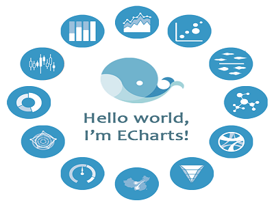

#  Python statistical analysis and visualization
> Note: This is the final-assignment for the course : Python statistical analysis and visualization


## Team members and arrangements：
1. **Li huayong（201721198598）**：Responsible for site construction and project coordination division
2. **Zhu siqi（201721198578）**：Responsible for adding `Pyecharts` chart
3. **Shen zizhuo（201722198326）**：Responsible for data analysis and Tang poetry
4. **Chen yue（201721198579）**：Responsible for writing introduction and summary
## github files：
* ` 数字唐诗.pptx`：Project presentation
* `tangpoemshow folder`：Project code
	* `manage.py`：Website startup code
	* `app folder`：Website files
	* ....

Website files：
```bash
项目:.
│   manage.py
│   tree.txt
│
├───.idea
│   │   encodings.xml
│   │   misc.xml
│   │   modules.xml
│   │   tangpoemshow.iml
│   │   vagrant.xml
│   │   workspace.xml
│   │
│   ├───dictionaries
│   │       Liangs.xml
│   │
│   └───inspectionProfiles
└───app
    │   data.py
    │   views.py
    │   __init__.py
    │
    ├───all_data_files
    │   ├───shuowenjiezi
    │   │       all-chars.txt
    │   │
    │   └───tangshicilin
    │           adj.txt
    │           n.txt
    │           nl.txt
    │           ns.txt
    │           nt.txt
    │           v.txt
    │
    ├───mycharts
    │   │   constants.py
    │   │   ShiRenGuanXi.py
    │   │   ShuoWenJieZi.py
    │   │   SiChouZhiLu.py
    │   │   __init__.py
    │
    │
    ├───static
    │   ├───css
    │   │       bootstrap.min.css
    │   │       docs.min.css
    │   │       github-markdown.css
    │   │       normalize.css
    │   │       patch.css
    │   │       styles.css
    │   │
    │   ├───echarts
    │   │       Afghanistan.js
    │   │       Albania.js
	(此处省略616个文件)
    │   │       Zimbabwe.js
    │   │
    │   ├───images
    │   │   │   favicon.ico
    │   │   │
    │   │   ├───about
    │   │   │       jishu.png
    │   │   │       poem.png
    │   │   │       techstack.png
    │   │   │
    │   │   └───index
    │   │           1.png
    │   │           2.png
    │   │           3.png
    │   │           4.png
    │   │           bootstrap.png
    │   │           Echarts.png
    │   │           FlaskLogo.png
    │   │
    │   ├───js
    │   │       bootstrap.min.js
    │   │       docs.min.js
    │   │       ie-emulation-modes-warning.js
    │   │       ie10-viewport-bug-workaround.js
    │   │       jquery.min.js
    │   │
    │   └───pdf
    │           des_words.pdf
    │
    ├───templates
    │       404.html
    │       500.html
    │       about.html
    │       base.html
    │       bootstrapBase.html
    │       index.html
    │       readme.txt
```
## Project Description：
>Through the statistics of the data of "Quan Tang poems" and CBDB database, this paper studies the characteristics and feelings of the Tang poems, the interpersonal relationships of the Tang poets, and the changes of the characteristics of the Tang poems on the Silk Road and the major trade cities Style

Tang poetry refers to the poems created in the Tang Dynasty. Tang poetry is one of the most precious cultural heritage of the Chinese nation and is a pearl in the treasure house of Chinese culture. It also exerts a great influence on the cultural development of many ethnic groups and countries in the world. , Customs, culture, etc. have an important reference value and value.
### Project Objectives：
Changes in the style of the Tang Dynasty also intuitively reflect the blending of different civilizations. In addition to silk fabrics, the trade on the Silk Road also brought advanced techniques and equipment for farming in the Huaxia ethnic group and promoted the transition from a nomadic civilization on the Silk Road to a farming civilization. Wang Jian, "Liangzhou line" - `" Fan people do not plow the old days, the school is now growing millet.Drive the sheep are also Kam clothing, for the carefree fur bucket ", to reflect the Silk Road Nomadic ethnic groups to cultivate new life. The prosperity of the Silk Road trade also stimulated the rapid development of animal husbandry and commerce in nomadic ethnic groups. Bai Juyi's "Yin Mountain Road" - "fifty" Since the Tang Dynasty, the nomadic peoples of the Silk Road enjoyed frequent trade with the Tang dynasty. At that time, the private trade volume reached an alarming degree.

The project aims as follows:

1. Through the statistics of ** "Tang Poetry" ** language and writing, the author analyzes and analyzes the characteristics and emotional color of words used in Tang poetry;
2. With the help of Chinese historical biography database CBDB ** to study the interpersonal relationships of the poets in the Tang Dynasty
3. On the ** along the Silk Road ** Tang poem classification analysis of the characteristics of the Tang Dynasty Silk Road changes in the Tang Dynasty and the main business city features


### Technology Introduction:
The background of the project is based on the Flask framework, the data display part uses pyEcharts, and the front end uses Bootstrap to beautify the interface. Below a brief introduction of these few technologies:
#### Flask


Flask is a lightweight web application framework written in Python. Based on Werkzeug WSGI (Python Web Server Gateway Interface, abbreviated WSGI) is an interface between a Python application or framework and a Web server, which has gained widespread acceptance and has basically reached its portability aspect Target) toolbox and Jinja2 template engine. Flask uses BSD license. Flask is also known as "microframework" because it uses a simple core and uses extensions to add other functionality. Flask does not use the default database, form validation tools. However, Flask preserves the flexibility of amplification and can incorporate these capabilities with the Flask-extension: ORM, forms validation tools, file uploads, and a variety of open-source authentication technologies.
#### pyEcharts


ECharts, abbreviated from Enterprise Charts, a business-grade data chart, a pure Javascript chart library that runs smoothly on PCs and mobile devices and is compatible with most current browsers (IE6 / 7/8/9/10/11, chrome, firefox, safari, etc.), and the bottom relies on the lightweight Canvas library ZRender to provide an intuitive, lively, interactive, highly customizable data visualization chart. Innovative drag and drop recalculation, data view, range roaming and other features greatly enhance the user experience, giving users the ability to tap the data, integration.

pyecharts is a class library for generating Echarts charts. With pyEcharts, you can translate Python code directly into Echarts JavaScript code, simplifying the integration of Echarts and Python projects. pyecharts can be very easy and Flask integration, it is entirely possible to use Flask call pyecharts dynamically generated charts while inserting other html elements, returned to the browser.
#### Bootstrap
![bootstrap] (./images/bootstrap.png)

Bootstrap is a set of open source frontend for the development of websites and web applications (so-called "frontend," which refers to the interface that is presented to the end user. The corresponding "backend" is the code that runs on the server) HTML, CSS and JavaScript framework to provide typography, forms, buttons, navigation, and other various components and Javascript extensions designed to make the development of dynamic web and web applications easier.

To use BootStrap in Flask requires Flask-Bootstrap extension. Flask-Bootstrap packages Bootstrap into an extension that consists mainly of a blueprint called "bootstrap." It is also possible to create a link to bootstrap from a CDN reference.
